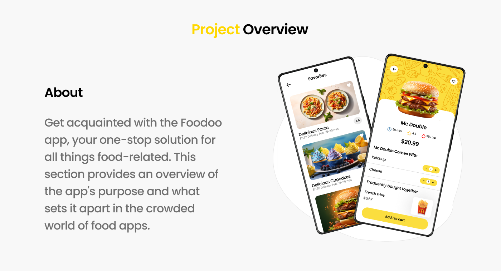

# Super Foodoo Mobile App UI Design

Figma mobile app designed by [Super Foodoo]([https://www.figma.com/@techcrowd](https://www.figma.com/file/wjIyOrWM59lEhTgNFq5OLU/Super-Foodoo-(Community)?type=design&mode=design&t=zavBNh8lLGyl3C0L-0)) on Figma

This is the UI implementation of the mobile design in Ionic 7 Angular 17



## Installation

For the installation, you will need node and angular pre-installed to get started!

```bash

npm install -g @ionic/cli

```

## Usage

```python

#for running the app browser

ionic serve

##for adding Android or IOS platform

npm i @capacitor/android @capacitor/ios

## Adding platform folders

npx cap add android
npx cap add ios

## for build folder

ionic build --prod

## syncing the changes to the platform folder

npx cap sync


```

## Contributing

Pull requests are welcome. Please open an issue to discuss what you would like to change for significant changes.

## License

MIT
